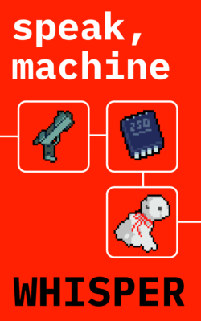
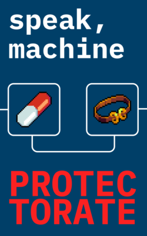

# Books

I have decided to make my science fiction writing publicly available here, for everyone to read. So far, the list contains two works: Whisper, a short story, and Protectorate, a novel.

## Books That I've Read

If you’re here for the list of books I have read, you can still [find the fiction list here](book-list.md), and the [programming books here](programming-books.md).

## FAQ

### Why are you publishing your books for free?

Because I want as many people as possible to read them. If you enjoy them, at the end of each story you will find a bunch of links where you can make a donation, and support me that way.

### Do you publish your stories anywhere else?

Yes. You can read the stories for free not just here, but also on [Royal Road](https://www.royalroad.com/profile/957219/fictions). Alternatively, you can [purchase my books on Amazon.](https://geni.us/protectorate)

### What can I do with your stories?

My stories are licensed under [CC BY-NC-SA](LICENSE). You can read them, share them with others, and you can even write fan-fiction (if you wish). However, I retain the rights to my stories, and so you can’t make money off of them. You can’t sell them, charge for them, and if you do write fan-fiction, you can’t charge for it, and you have to publish it under the same license.

### If I spot an error, can I open an issue and request that it be corrected?

Yes.

### How can I support your work?

If you would like to help me produce more works, [consider supporting me](https://speakmachine.link/donate). Alternatively, you can leave a star on this repo, if you have a GitHub account, to help it shine.
